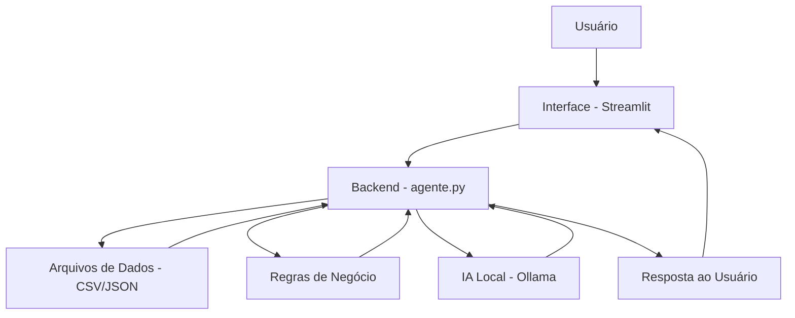

# DIO-Assistente_Financeiro_IA

## 💸 Finni - Assistente Financeiro Inteligente
O **Finni** é um assistente virtual desenvolvido para ajudar usuários a **registrar**, **organizar**, e **consultar despesas pessoais** 
de forma simples, prática e conversacional.

A aplicação combina **regras de negócio**, **base de conhecimento local (CSV/JSON)** e **IA generativa com Ollama** para oferecer respostas
úteis no contexto de controle financeiro pessoal.

---

## 🚀 Funcionalidades
Atualmente, o Finni permite:
- ✅ Registrar novas despesas
- ✅ Categorizar gastos automaticamente
- ✅ Consultar o saldo atual do usuário
- ✅ Consultar o total gasto no mês
- ✅ Consultar gastos por categoria
- ✅ Ver últimas transações registradas
- ✅ Emitir alertas financeiros simples
- ✅ Responder perguntas com apoio de IA local (Ollama)

---

## 🛠 Tecnologias Utilizadas
- Python
- Streamlit
- Pandas
- Ollama
- CSV / JSON

---

## 🏗 Arquitetura

---

## ▶️ Como Executar

### 1. Instale as dependências
`pip install -r src/requirements.tx`

### 2. Inicie o Ollama
`ollama serve`

### 3. Baixe um modelo local
Exemplo: `phi3:mini`

### 4. Execute a aplicação
`cd src`
`streamlit run app.py`

---

## 📄 Documentação
A documentação detalhada do projeto está disponível na pasta:
`docs/`

---

## Profeto Desenvolvido por: 
Ana Paula de Almeida Coiado

    

