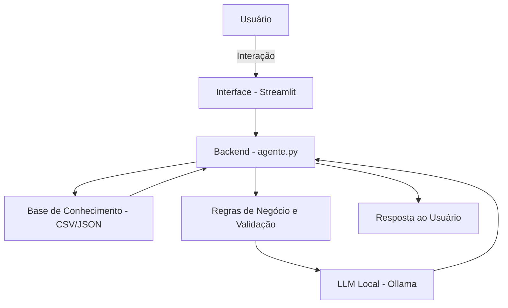

# Documentação do Agente

## Caso de Uso

### Problema
> Qual problema financeiro seu agente resolve?

Muitas pessoas têm dificuldade no controle de suas despesas diárias, não registrando seus gastos corretamente e perdendo o 
controle financeiro ao longo do mês. Isso gera desorganização, falta de planejamento e, em alguns casos, endividamento.

### Solução
> Como o agente resolve esse problema de forma proativa?

O agente atua como um assistente financeiro pessoal permitindo ao usuário o registro de despesas de forma simples por meio
de conversa. Ele organiza automaticamente os gastos, categoriza as despesas e fornece resumos e alertas para ajudar o 
usuário a tomar decisões mais conscientes.

O agente também atua de forma proativa ao:
- Sugerir economia com base nos hábitos do usuário
- Alertar quando há excesso de gastos em determinada categoria
- Informar o total gasto em períodos específicos

### Público-Alvo
> Quem vai usar esse agente?

Pessoas que desejam controlar melhor suas finanças pessoais, especialmente:
- Jovens e adultos com pouca organização financeira
- Pessoas que não utilizam planilhas ou sistemas complexos
- Usuários que preferem interações simples (chat) ao invés de ferramentas tradicionais

---

## Persona e Tom de Voz

### Nome do Agente
Finni

### Personalidade
> Como o agente se comporta? (ex: consultivo, direto, educativo)

- Educativo
- Amigável
- Direto
- Proativo
O agente busca orientar o usuário sem julgamentos, incentivando melhores hábitos financeiros.

### Tom de Comunicação
> Formal, informal, técnico, acessível?

- Linguagem simples e acessível
- Levemente informal
- Evita termos técnicos complexos
- Objetivo e claro

### Exemplos de Linguagem
- Saudação: "Olá! Como posso ajudar com suas finanças hoje?"
- Confirmação: "Ok. Gasto com alimentação registrado."
- Erro/Limitação: "Não tenho essa informação, mas posso ajudar a registrar ou consultar seus gastos."

---

## Arquitetura

### Diagrama

### Componentes

| Componente | Descrição |
|------------|-----------|
| **Interface** | Aplicação em **Streamlit** usada para interação com o usuário, permitindo registrar despesas, consultar informações financeiras e conversar com o assistente Finni. |
| **Backend** | Arquivo **`agente.py`**, responsável pela lógica de negócio, tratamento de perguntas, leitura dos dados e integração com o modelo local. |
| **LLM** | **Ollama**, utilizado para executar localmente um modelo de linguagem generativa, sem dependência de APIs externas. |
| **Base de Conhecimento** | Arquivos **CSV** e **JSON** armazenados na pasta `data/`, contendo dados mockados de usuários, transações, categorias, alertas e limites de gastos. |
| **Validação e Regras** | Conjunto de regras implementadas no backend para responder perguntas objetivas sem depender do LLM, além de limitar respostas ao contexto financeiro e evitar informações inventadas. |

---

- [X] O agente responde com base nos dados disponíveis na base de conhecimento (`CSV` e `JSON`) e no contexto montado para cada usuário.
- [X] Foram implementadas regras de negócio para responder perguntas objetivas sem depender exclusivamente do modelo de linguagem.
- [X] Há validação básica de entradas, como nome do usuário, valor da despesa e categorização das transações.
- [X] Quando não possui informação suficiente, o agente informa claramente sua limitação em vez de inventar respostas.
- [X] O agente é restrito ao contexto de controle de despesas pessoais, evitando responder fora do escopo financeiro definido.
- [X] Não realiza previsões financeiras ou análises futuras sem base em dados concretos.
- [X] Não fornece aconselhamento financeiro profissional, especialmente sobre investimentos, crédito ou decisões patrimoniais complexas.

### Limitações Declaradas
> O que o agente NÃO faz?

- Não possui integração com bancos, cartões ou instituições financeiras reais.
- Não importa automaticamente extratos ou movimentações bancárias.
- Não realiza recomendações de investimento.
- Não substitui um contador, consultor financeiro ou planejador financeiro profissional.
- Não executa análise financeira avançada, como projeção patrimonial, tributária ou de endividamento.
- Não garante precisão caso o usuário informe dados incorretos ou incompletos.
- Não interpreta documentos financeiros externos, como boletos, faturas em PDF ou notas fiscais.
- Não possui autenticação, criptografia ou controle de acesso avançado, por se tratar de um protótipo acadêmico.
