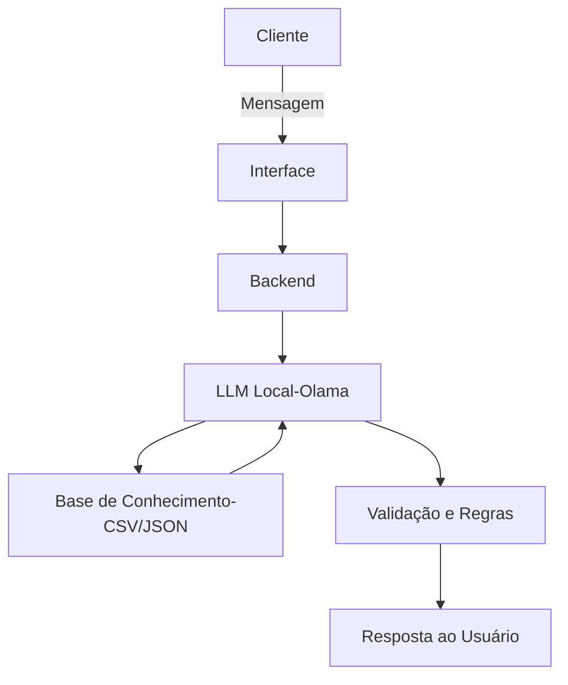

# Documentação do Agente

## Caso de Uso

### Problema
> Qual problema financeiro seu agente resolve?

Muitas pessoas têm dificuldade no controle de suas despesas diárias, não registrando seus gastos corretamente e perdendo o 
controle financeiro ao longo do mês. Isso gera desorganização, falta de planejamento e, em alguns casos, endividamento.

### Solução
> Como o agente resolve esse problema de forma proativa?

O agente atua como um assistente financeiro pessoal permitindo ao usuário o registro de despesas de forma simples por meio
de conversa. Ele organiza automaticamente os gastos, categoriza as despesas e fornece resumos e alertas para ajudar o 
usuário a tomar decisões mais conscientes.

O agente também atua de forma proativa ao:
- Sugerir economia com base nos hábitos do usuário
- Alertar quando há excesso de gastos em determinada categoria
- Informar o total gasto em períodos específicos

### Público-Alvo
> Quem vai usar esse agente?

Pessoas que desejam controlar melhor suas finanças pessoais, especialmente:
- Jovens e adultos com pouca organização financeira
- Pessoas que não utilizam planilhas ou sistemas complexos
- Usuários que preferem interações simples (chat) ao invés de ferramentas tradicionais

---

## Persona e Tom de Voz

### Nome do Agente
Finni

### Personalidade
> Como o agente se comporta? (ex: consultivo, direto, educativo)

- Educativo
- Amigável
- Direto
- Proativo
O agente busca orientar o usuário sem julgamentos, incentivando melhores hábitos financeiros.

### Tom de Comunicação
> Formal, informal, técnico, acessível?

- Linguagem simples e acessível
- Levemente informal
- Evita termos técnicos complexos
- Objetivo e claro

### Exemplos de Linguagem
- Saudação: "Olá! Como posso ajudar com suas finanças hoje?"]
- Confirmação: "Ok. Gasto com alimentação registrado."]
- Erro/Limitação: "Não tenho essa informação, mas posso ajudar a registrar ou consultar seus gastos."]

---

## Arquitetura

### Diagrama

### Componentes

| Componente | Descrição |
|------------|-----------|
| Interface | [Chatbot (Streamlit ou Gradio] |
| LLM | [Ollama - modelo local executado na máquina] |
| Base de Conhecimento | [Arquivos JSON/CSV com dados do cliente] |
| Validação | [Checagem de alucinações] |

---

## Segurança e Anti-Alucinação

### Estratégias Adotadas

- [X] [Agente só responde com base nos dados fornecidos]
- [X] [Validação de entradas (valores, datas e categorias)]
- [X] [Quando não sabe, informa claramente ao usuário]
- [X] [Não realiza previsões financeiras sem dados suficientes]
- [X] [Não fornece aconselhamento financeiro profissional (ex.: investimentos]

### Limitações Declaradas
> O que o agente NÃO faz?

- Controle automático de contas bancárias (sem integração com bancos)
- Recomendações de investimentos
- Análise financeira avançada (ex.: planejamento tributário)
- Substituição de um contador ou consultor financeiro
- Garantia de precisão caso o usuário informe dados incorretos
